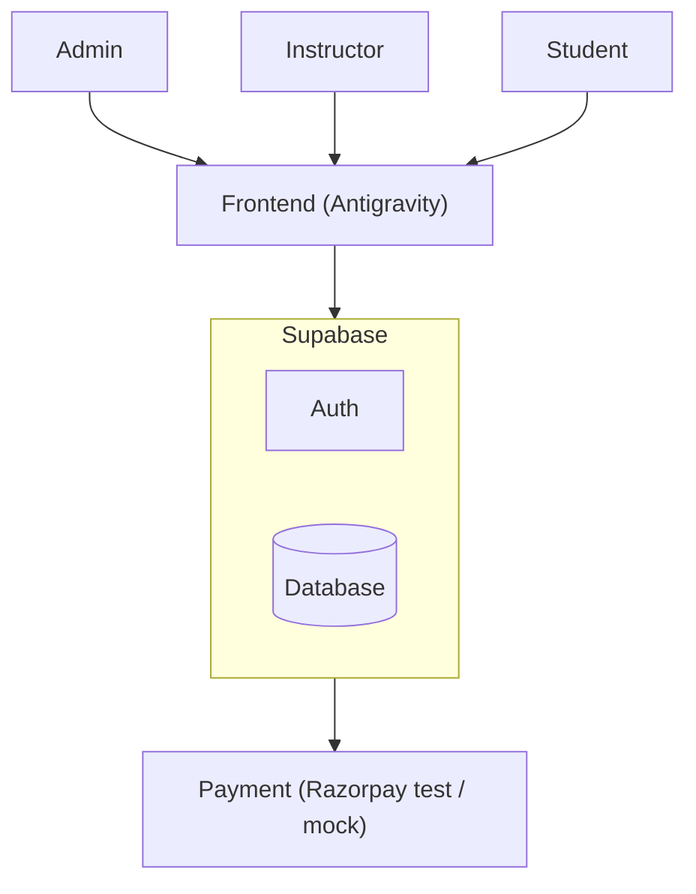

# Driving School Management: Simple Plan

**Stack:** Supabase (backend) + Antigravity (frontend)

## Roles
| Role | What they do |
|---|---|
| **Admin** | Add instructors and cars, see all bookings and payments |
| **Instructor** | See paid slots, student contact, add performance score |
| **Student** | Book a slot, pay, see performance |

## Architecture



## Booking Flow
1. Student picks date, time, car and instructor
2. Student pays
3. Booking is confirmed
4. Instructor sees the paid slot
5. After the lesson, instructor adds a performance score
6. Student sees the score

## Database Tables
| Table | Key fields |
|---|---|
| `profiles` | id, name, phone, role (admin / instructor / student) |
| `vehicles` | id, reg_number, model |
| `bookings` | id, student_id, instructor_id, vehicle_id, date, start_time, status |
| `payments` | id, booking_id, amount, status |
| `reviews` | id, booking_id, score, notes |

```sql
create table profiles (
  id uuid primary key references auth.users(id),
  name text, phone text,
  role text check (role in ('admin','instructor','student'))
);

create table vehicles (
  id uuid primary key default gen_random_uuid(),
  reg_number text unique, model text
);

create table bookings (
  id uuid primary key default gen_random_uuid(),
  student_id uuid references profiles(id),
  instructor_id uuid references profiles(id),
  vehicle_id uuid references vehicles(id),
  date date, start_time time,
  status text default 'pending',
  unique (instructor_id, date, start_time),
  unique (vehicle_id, date, start_time)
);

create table payments (
  id uuid primary key default gen_random_uuid(),
  booking_id uuid references bookings(id),
  amount numeric, status text default 'created'
);

create table reviews (
  id uuid primary key default gen_random_uuid(),
  booking_id uuid references bookings(id),
  score int, notes text
);
```

The `unique` rules stop double booking of an instructor or car.

## Build Order
1. Supabase setup, tables, login with 3 roles
2. Admin: add instructors and cars
3. Student: book a slot
4. Payment (mock it if short on time)
5. Instructor: view slots and add score
6. Student: view score

## Only If Time Is Left
Learning videos, license tracker, incident reports, reminders.

## Demo (3 min)
Admin adds instructor and car, then student books and pays, then instructor sees the slot and adds a score, then student sees the progress.
